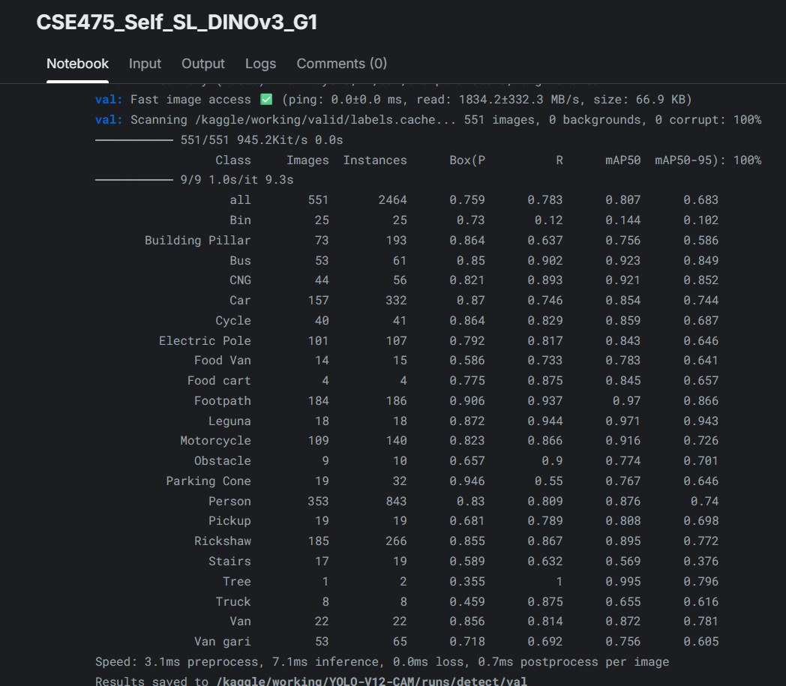
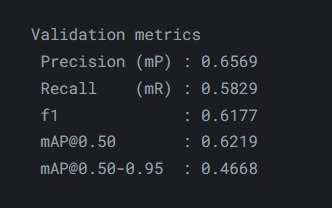
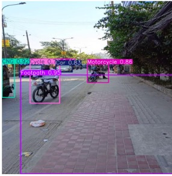
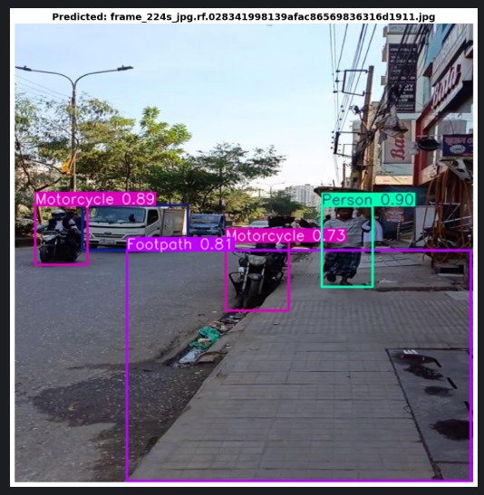
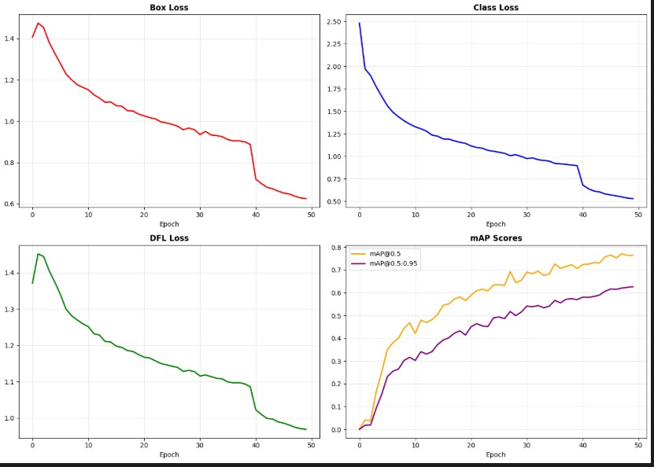

# 👁️ NavAssist: Label-Efficient Object Detection for Visually Impaired Navigation

[](https://www.python.org/downloads/release/python-3100/)
[](https://pytorch.org/)
[](https://opensource.org/licenses/MIT)
[](https://arxiv.org/)

> **A comparative study of YOLOv12 baselines and Self-Supervised Learning (SimCLR, DINOv3) for robust urban object detection with limited annotations.**

---

##  Abstract
Independent navigation in complex urban environments poses significant safety risks for visually impaired individuals. Existing solutions often rely on GPS, which lacks local semantic understanding, or fully supervised deep learning models that require expensive, large-scale annotation.

This project introduces **NavAssist**, a label-efficient object detection framework designed for 22 classes of urban obstacles (e.g., *Rickshaw, Open Drain, Footpath*). We establish strong baselines using **YOLOv10, YOLOv11, and YOLOv12** and address the data scarcity bottleneck by integrating:
1.  **Semi-Supervised Learning (SSL):** **STAC** protocol to leverage 80% unlabeled data.
2.  **Self-Supervised Learning (Self-SL):** **SimCLR** and **DINOv3** for label-free representation learning.

Our results demonstrate that DINOv3 pre-training significantly improves detection robustness in occluded environments compared to standard supervised initialization.


##  Core Architecture & Methodology

### 1. Advanced Baselines (YOLOv10 - YOLOv12)
We benchmarked the latest iterations of the YOLO family:
* **YOLOv10:** Introduces NMS-free training via consistent dual assignments, reducing inference latency.
* **YOLOv11:** Features a refined backbone with dynamic detection heads for better multi-scale feature aggregation.
* **YOLOv12:** Shifts to an **attention-centric architecture** using FlashAttention and Area Attention, significantly improving feature extraction for small urban obstacles.

### 2. Semi-Supervised Learning: STAC
To utilize unannotated video frames, we implemented **STAC (Self-Training and Augmentation driven Consistency)**.
* **Teacher-Student:** A teacher model (trained on limited data) generates pseudo-labels for unlabeled images.
* **Consistency:** The student model is forced to predict these pseudo-labels even when the input image is strongly augmented (Color Jitter, Cutout), ensuring robustness to environmental changes.

### 3. Self-Supervised Learning: SimCLR & DINOv3
We replaced ImageNet pre-training with domain-specific self-supervised learning:
* **SimCLR:** Uses a **Contrastive Loss (NT-Xent)** to maximize agreement between two augmented views of the same image, learning to distinguish unique urban features without labels.
* **DINOv3 (State-of-the-Art):** Utilizes a **Teacher-Student Distillation** approach with no labels. It employs "centering" and "sharpening" to prevent mode collapse, allowing the model to learn dense semantic features (like object boundaries) automatically.

---

##  Dataset Overview
The **Urban Navigation Dataset** captures the chaotic nature of South Asian traffic.
* **Source:** [Mendeley Data](https://data.mendeley.com/datasets/m68g3h7p87/1)
* **Total Images:** 7,023
* **Classes (22):** `Bus`, `CNG`, `Rickshaw`, `Person`, `Open Drain`, `Electric Pole`, `Stairs`, etc.
* **Data Split:**
    * **Train:** 70% (of which only 20% is labeled for SSL experiments)
    * **Validation:** 20%
    * **Test:** 10%

---
##  Performance & Results

We evaluated our models on the held-out test set. **DINOv3 (Self-Supervised)** demonstrated the strongest generalization capabilities, achieving an **mAP@0.50 of 0.807**, significantly outperforming the SimCLR approach (0.621).

### 1. Quantitative Analysis
| Model Strategy | Precision | Recall | mAP@0.50 | mAP@0.5:0.95 |
| :--- | :--- | :--- | :--- | :--- |
| **SimCLR + YOLO** | 0.65 | 0.58 | 0.62 | 0.46 |
| **DINOv3 + YOLO** | **0.76** | **0.78** | **0.81** | **0.68** |

**Metric Proof:**
<p float="left">
  
  
</p>

> *Figure: Validation metrics showing DINOv3 (Left) outperforming SimCLR (Right).*

---

### 2. Visual Detection Quality
The DINOv3-pretrained model successfully detects small and occluded objects in dense traffic scenes.

**DINOv3 Prediction:**


**Semi-Supervised (STAC) Prediction:**


---

### 3. Training Dynamics (Loss Curves)
The STAC model shows stable convergence across Box and Class loss metrics, validating the efficacy of the consistency regularization loss.



##  Installation & Usage

### 1. Clone Repository
```bash
git clone [https://github.com/MehrajRahman/Object_Detection-Navigation_Assistance_for_the_Visually_Impaired_People.git](https://github.com/MehrajRahman/Object_Detection-Navigation_Assistance_for_the_Visually_Impaired_People)
cd CSE475-NavAssist-ObjectDetection
```

##  Repository Structure

This project follows a modular directory structure to ensure reproducibility and separation of concerns.

```plaintext
Object_Detection-Navigation_Assistance_for_the_Visually_Impaired_People/
├── assets/              #  Diagrams, flowcharts, and sample prediction images
├── configs/             #  Hyperparameter configurations (YAML files)
├── notebooks/           #  Jupyter Notebooks for experimental pipelines
│   ├── 1_Baseline_YOLOv12.ipynb      # Supervised baseline training
│   ├── 2_SemiSupervised_STAC.ipynb   # STAC protocol implementation
│   └── 3_SelfSupervised_DINOv3.ipynb # DINOv3 pre-training & fine-tuning
├── src/                 #  Core source code for custom models and utils
├── results/             #  Saved metrics, confusion matrices, and log files
└── requirements.txt     #  Python dependencies for environment setup
```


## CITATION
@techreport{navassist2025,
  title={Object Detection: Navigation Assistance for Visually Impaired People},
  author={Rahman, Mehraj and Islam, Robiul and Ashraf, Sunzid},
  institution={Department of CSE, East West University},
  year={2025}
}

##  Technical Architecture & Design Choices

This section outlines the rationale behind our architectural decisions, highlighting how specific models address the challenges of urban navigation for the visually impaired.

### 1. Baseline Architecture: YOLOv12
**Why we chose it:**
Unlike previous iterations that rely solely on CNNs, YOLOv12 integrates **Area Attention mechanisms**.
* **The Technical Edge:** Urban scenes in Dhaka are highly cluttered. Standard CNNs often struggle to differentiate overlapping objects (e.g., a rickshaw vs. a crowd). The attention mechanism allows the model to dynamically focus on relevant spatial features while suppressing background noise, mimicking the efficacy of Transformer-based models with the speed of YOLO.

### 2. Semi-Supervised Strategy: STAC
**Addressing Data Scarcity:**
With over 7,000 images available but limited labeling resources, we employed the **STAC (Self-Training and Augmentation driven Consistency)** protocol.
* **Mechanism:**
    1.  **Teacher Phase:** A model is trained on the labeled subset (20%).
    2.  **Pseudo-Labeling:** The Teacher generates labels for the remaining 80% of unlabeled data (filtering for confidence > 0.9).
    3.  **Consistency Regularization:** A "Student" model is trained to predict these pseudo-labels on **strongly augmented** versions of the images (e.g., color jitter, cutout). This forces the model to learn structural invariance rather than relying on superficial color cues.

### 3. Self-Supervised Pre-training: DINOv3
**Domain-Specific Feature Learning:**
Standard object detectors are pre-trained on ImageNet, which differs significantly from our chaotic urban dataset.
* **The Solution:** We utilized **DINOv3 (Self-Distillation with no Labels)** to pre-train our backbone on our specific dataset without labels.
* **How it Works:** It employs a Teacher-Student distillation framework where the Teacher is an exponential moving average (EMA) of the Student. This process learns to distinguish semantic categories (e.g., differentiating a "CNG" from a "Bus") based purely on visual structure, resulting in features that are far more robust than generic ImageNet weights.

### 4. Ablation Analysis
To validate our hyperparameters, we conducted an ablation study on the **Pseudo-Label Confidence Threshold** for STAC.
* **Experiment:** We compared thresholds of $\tau=0.7$ vs. $\tau=0.9$.
* **Finding:** Lower thresholds ($\tau=0.7$) introduced significant label noise (false positives), while $\tau=0.9$ provided the optimal balance of high-quality pseudo-labels and sufficient data volume for the Student model.

##  Notebooks & Implementation

We have made our experimental pipelines publicly available on Kaggle to ensure reproducibility.

| Experiment | Model / Method | Kaggle Notebook |
| :--- | :--- | :--- |
| **Baseline 1** | **YOLOv10** (Efficiency Focus) | [](https://www.kaggle.com/code/robiulislamistaken/cse475-sec03-group1-yolov10) |
| **Baseline 2** | **YOLOv11** (Feature Aggregation) | [](https://www.kaggle.com/code/robiulislamistaken2/cse475-sec03-group1-yolov11) |
| **Baseline 3** | **YOLOv12** (Attention Mechanism) | [](https://www.kaggle.com/code/tanjiromegumi/cse475-sec03-group1-yolov12) |
| **Semi-SL** | **STAC** (Pseudo-Labeling) | [](https://www.kaggle.com/code/robiulislamistaken2/cse475-semi-sl-pseudo-stac) |
| **Self-SL** | **SimCLR** (Contrastive Learning) | [](https://www.kaggle.com/code/mahmudurrahman00627/cse475-self-sl-simclr-g1) |
| **Self-SL** | **DINOv3** (Self-Distillation) | [](https://www.kaggle.com/code/robiulislamistaken2/cse475-self-sl-dinov3-g1) |


##  Supervision
**Dr. Mohammad Rifat Ahmmad Rashid**

*Associate Professor*

Department of Computer Science & Engineering
East West University

## Collaborators
* **Md. Robiul Islam** 
* **Sunzid Ashraf** 
* **Md. Mahamudur Rahman Maharaz** 

*Department of Computer Science and Engineering, East West University.*

---